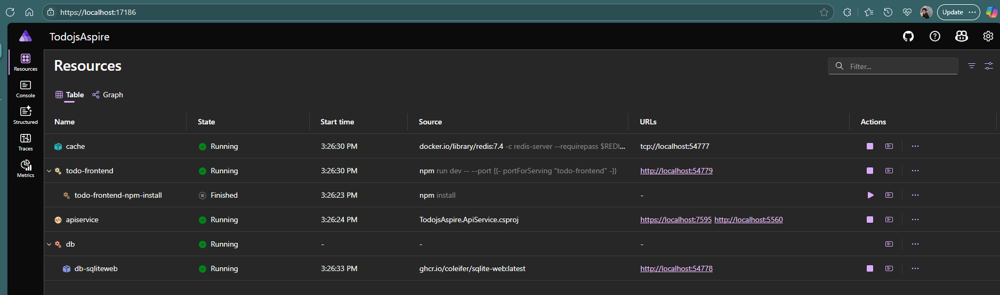
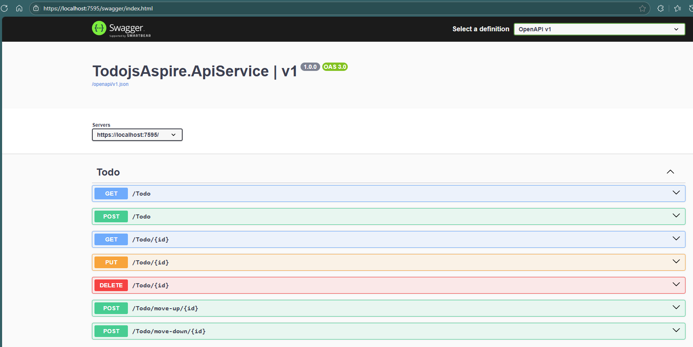
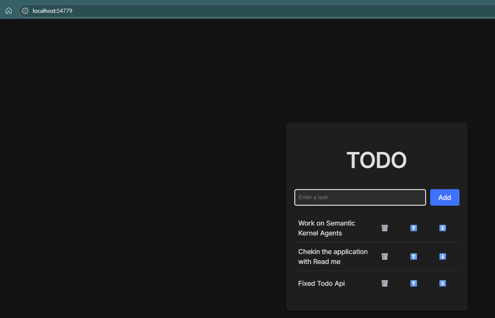
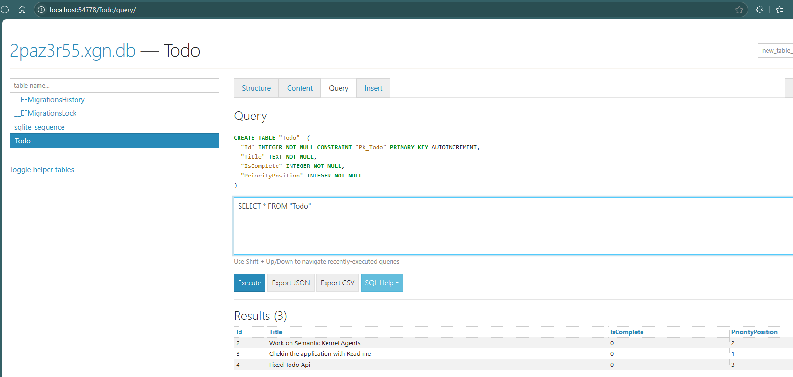
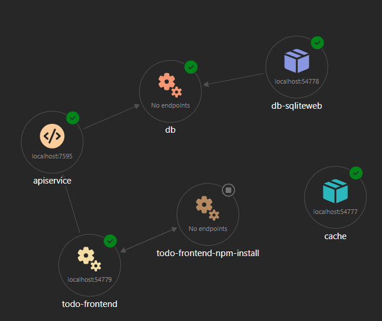

# Fullstack To-Do Application using .NET Aspire and React

A modern fullstack to-do application built with .NET Aspire for the backend orchestration and React with Vite for the frontend. This project demonstrates how to create a distributed application with service discovery, health checks, and seamless development experience.

## 🏗️ Architecture

- **Backend API**: ASP.NET Core Web API with Entity Framework Core and SQLite
- **Frontend**: React application built with Vite
- **Orchestration**: .NET Aspire for service management and configuration
- **Database**: SQLite with Entity Framework Core migrations
- **Caching**: Redis (configured but optional)

## 📋 Features

- ✅ Add new todo items
- ✅ Delete todo items
- ✅ Move items up/down in the list
- ✅ Real-time updates
- ✅ Responsive design
- ✅ Health checks and monitoring
- ✅ Service discovery through Aspire

## 🚀 Getting Started

### Prerequisites

- [.NET 8 SDK](https://dotnet.microsoft.com/download/dotnet/8.0)
- [Node.js](https://nodejs.org/) (v18 or later)
- [Docker](https://www.docker.com/) (for Redis, optional)

### Setup Instructions

1. **Clone the repository**
   ```bash
   git clone <your-repo-url>
   cd TodojsAspire
   ```

2. **Install .NET Aspire workload**
   ```bash
   dotnet workload install aspire
   ```

3. **Create the React frontend** (if not already created)
   ```bash
   npm create vite@latest todo-frontend -- --template react
   ```

4. **Add Aspire packages for Node.js support**
   ```bash
   # Add Node.js support to Aspire
   dotnet add TodojsAspire.AppHost package Aspire.Hosting.NodeJs
   
   # Add community toolkit for Vite support
   dotnet add TodojsAspire.AppHost package CommunityToolkit.Aspire.Hosting.NodeJs.Extensions
   ```

5. **Install frontend dependencies**
   ```bash
   cd todo-frontend
   npm install
   cd ..
   ```

6. **Run the application**
   ```bash
   dotnet run --project TodojsAspire.AppHost
   ```

   This will start:
   - The Aspire dashboard (usually at `https://localhost:17000`)
   - The API service
   - The React frontend
   - Redis cache
   - SQLite database

## Screen shots

*Aspire Dashboard*



*Backend endpoints*


*Frontend application*


*Sqlite table*


*Aspire Resources - Graph view*

## 🔧 Configuration

### Vite Configuration

The `vite.config.js` is configured to:
- Use environment variables from Aspire for service discovery
- Proxy API requests to the backend service
- Handle HTTPS/HTTP endpoints automatically

```javascript
export default defineConfig(() => {
  const apiUrl = process.env.services__apiservice__https__0 || process.env.services__apiservice__http__0;
  
  return {
    plugins: [react()],
    server: {
      port: parseInt(process.env.VITE_PORT) || 3000,
      proxy: {
        '/api': {
          target: apiUrl,
          changeOrigin: true,
          secure: false,
          rewrite: (path) => path.replace(/^\/api/, '')
        }
      }
    }
  }
})
```

### API Endpoints

- `GET /Todo` - Get all todo items
- `POST /Todo` - Create a new todo item
- `DELETE /Todo/{id}` - Delete a todo item
- `POST /Todo/move-up/{id}` - Move item up in the list
- `POST /Todo/move-down/{id}` - Move item down in the list
- `GET /health` - Health check endpoint

## 📁 Project Structure

```
TodojsAspire/
├── TodojsAspire.ApiService/     # ASP.NET Core Web API
│   ├── Models/                  # Data models
│   ├── Migrations/              # EF Core migrations
│   ├── Program.cs               # API startup
│   └── TodoEndpoints.cs         # API endpoints
├── TodojsAspire.AppHost/        # Aspire orchestration
│   └── AppHost.cs               # Service configuration
├── TodojsAspire.ServiceDefaults/ # Shared service configuration
├── todo-frontend/               # React frontend
│   ├── src/
│   │   ├── components/
│   │   │   ├── TodoList.jsx     # Main todo component
│   │   │   └── TodoItem.jsx     # Individual todo item
│   │   └── App.jsx
│   └── vite.config.js           # Vite configuration
└── README.md
```

## 🐛 Troubleshooting

### Common Issues

1. **API requests failing**
   - Check if the Aspire dashboard shows all services as healthy
   - Verify the proxy configuration in `vite.config.js`
   - Ensure environment variables are being set correctly

2. **Frontend not connecting to API**
   - Restart the Aspire application to refresh environment variables
   - Check the browser network tab for failed requests
   - Verify the API service is running on the expected port

3. **Database issues**
   - Run migrations: `dotnet ef database update --project TodojsAspire.ApiService`
   - Check if SQLite file is created in the API project

## 🔍 Monitoring

The Aspire dashboard provides:
- Service health status
- Logs from all services
- Metrics and telemetry
- Environment variables
- Service endpoints

Access it at the URL shown when you run the AppHost project.

## 🤝 Contributing

1. Fork the repository
2. Create a feature branch
3. Make your changes
4. Test thoroughly
5. Submit a pull request

## 📝 License

This project is licensed under the MIT License.